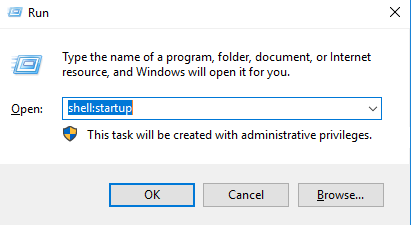
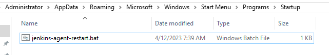

# Configuring Jenkins Windows Agent

[](https://github.com/shenxianpeng/jenkins-windows-agent/actions/workflows/test.yml)

Configuring Jenkins Windows agent is very annoying and often encounters various problems. This repository makes it easier to set up the Jenkins Windows agent as a service on Windows.

## Download dependencies

For example: your Remote root directory of the Windows agent is `C:\agent`

Then just git clone this repo and run `main.bat` under the Remote root directory.

```bat
cd C:\agent
git clone https://github.com/shenxianpeng/jenkins-windows-agent.git && cd jenkins-windows-agent

main.bat
```

## Manual update `jenkins-agent.xml`

Before installing `jenkins-agent.exe` as a service, you need to update `jenkins-agent.xml` following attributes.

* `<executable>`

    path to java.exe. for example `<executable>C:\agent\jdk-11.0.2\bin\java.exe</executable>`

* `<arguments>`

    `<arguments> -jar agent.jar -jnlpUrl http://your-jenkins-hostname:8080/computer/your-windows-agent-name/jenkins-agent.jnlp -secret d194c768ff6379a8a4ccde6fe98d67ee7b02bc2afb5b3e0517722643c39bff87 -workDir "C:\agent"</arguments>`

    You can find these arguments on Jenkins.

    Node -> Configure -> Launch method, chose "**Launch agent by connecting it to the controller**".

    Then you will see .

## Install and start service

Install Jenkins Agent as a service

```bat
C:\agent>jenkins-agent.exe install
2022-09-06 21:06:51,629 INFO  - Installing service 'Jenkins Agent for jenkins:8080 (jenkins8080agent)'...
2022-09-06 21:06:51,659 INFO  - Service 'Jenkins Agent for jenkins:8080 (jenkins8080agent)' was installed successfully.
```

Then start Jenkins agent service

```bat
C:\agent>jenkins-agent.exe start
2022-09-06 21:06:56,850 INFO  - Starting service 'Jenkins Agent for jenkins:8080 (jenkins8080agent)'...
2022-09-06 21:06:57,285 INFO  - Service 'Jenkins Agent for jenkins:8080 (jenkins8080agent)' started successfully.
```

More commands to run

```bat
C:\agent>jenkins-agent.exe --help
```

## Start Jenkins agent service after reboot

Sometimes the Jenkins agent service can not be started automatically after Windows reboot.

Steps to find Startup folder: Click Windows + R -> type `shell:startup` -> click OK



Copy the batch file `jenkins-agent-restart.bat` to the Windows Startup folder, it will restart service with command `jenkins-agent.exe restart`.



## References

* How to Install Jenkins Agent on Windows YouTuBe [video](https://youtu.be/N8AQTlHoBKc)
* How to install Windows agents as a service? [article](https://support.cloudbees.com/hc/en-us/articles/217423827-How-to-install-Windows-agents-as-a-service-).
